# Handoff: Pi CAM — Verified Capture Mobile App

## Overview

**Pi CAM** is a mobile app concept for cryptographically-signed photo and video capture. Every shot is signed at capture time (C2PA-style manifest), then certified by a remote CA when the device is online — so the user can prove a photo is real, untampered, and came from this device.

This package contains the **complete UI/UX design** for the app: 8 screens, a shared component library, light + dark theme, and several layout/HUD variations the team explored. The goal of this handoff is for a developer (working with Claude Code) to **rebuild the design in a real mobile codebase**.

### Screen gallery

| Splash | Onboarding | Camera (Classic) | Preview |
|---|---|---|---|
| 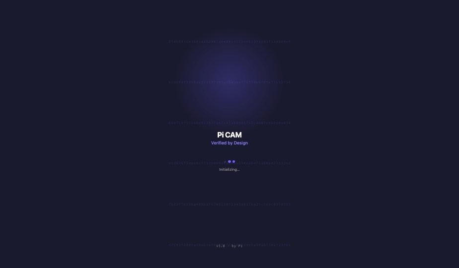 | 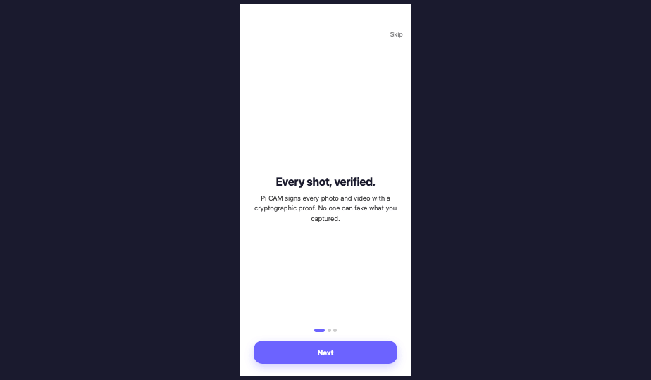 | 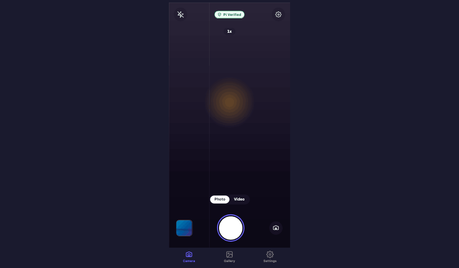 | 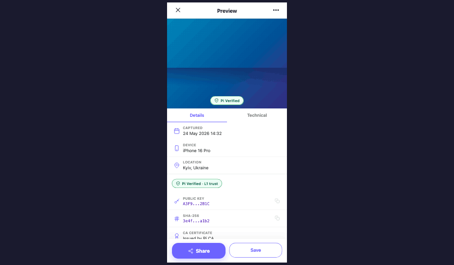 |

| Gallery | Verify | Settings | Manifest |
|---|---|---|---|
| 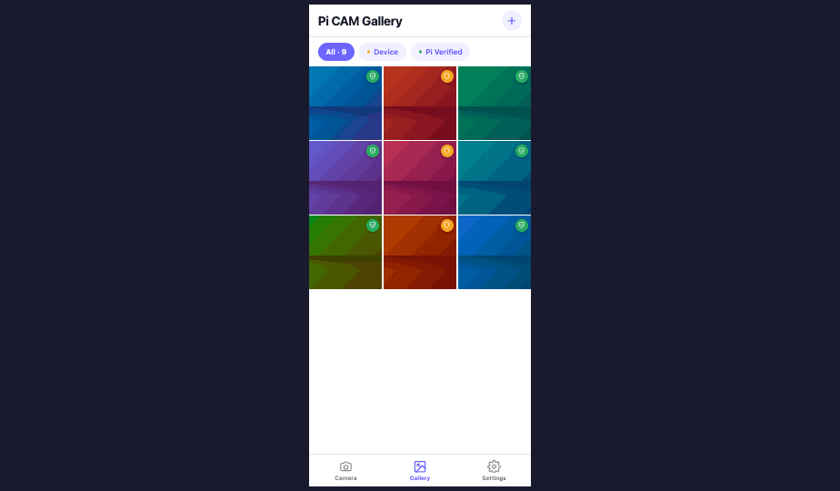 | 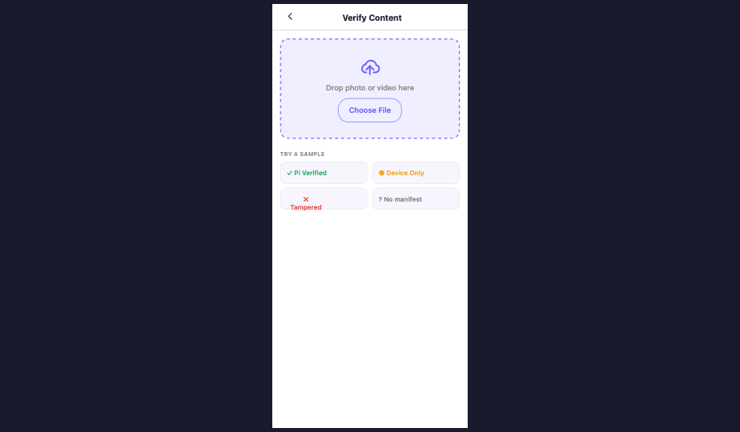 | 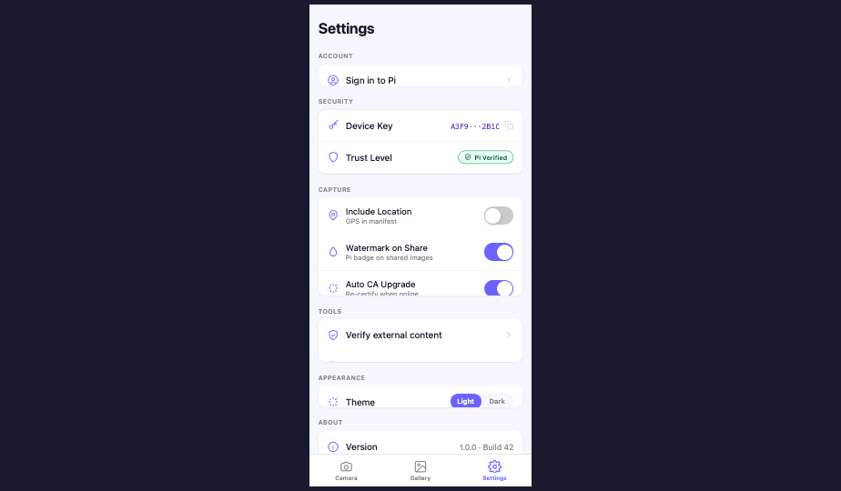 | 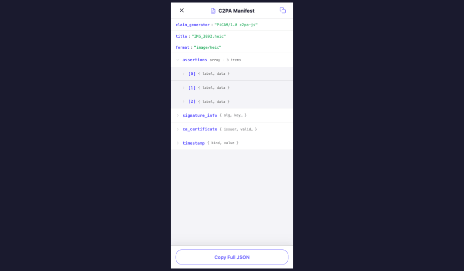 |

> All screenshots live in `screenshots/`. Open `Pi CAM Design.html` in a browser for the live, interactive prototype.

### Companion files in this bundle
- **`CLAUDE.md`** — implementation guide for **React Native (Expo)**: stack, dependencies, a paste-ready theme file, HTML→RN mapping, navigation, a fully-ported example component, and build order. **Start here when coding.**
- **`SPECS.md`** — pixel-perfect spec for every screen: exact sizes, paddings, type, colors, and states.
- **`screenshots/`** — reference renders of every screen + camera variant.
- **`Pi CAM Design.html`** + `lib/` + `screens/` — the live browser prototype (design reference, not product code).

---

## About the Design Files

The files in this bundle are **design references created in HTML/React (browser)** — interactive prototypes used to explore look-and-feel, behavior, and screen flow. They are **not production code to copy directly**.

The implementation task is to **recreate these designs in the target codebase's environment** — typically a native mobile stack (React Native, SwiftUI, Jetpack Compose, or Flutter). If no codebase exists yet, choose the framework that best fits the product (React Native is the closest 1:1 to the existing JSX). Reuse the codebase's existing design tokens, component library, navigation patterns, and animation primitives wherever they exist — the HTML is a spec for *what* to build, not *how*.

Key things the HTML mockups **do not** represent and should not be carried over verbatim:
- Inline `style={{ ... }}` everywhere → replace with the codebase's styling system (StyleSheet, Tailwind, NativeWind, etc.)
- Browser-only APIs (`backdrop-filter`, CSS animations by class name) → use the platform's blur view + animation library
- `<div>` / `<button>` → native equivalents (`<View>`, `<Pressable>`, `UIButton`, `Button`, etc.)
- Babel-in-browser script tag loading → standard module imports
- `PHOTOS` fake data array → wire to the real capture pipeline

---

## Fidelity

**High-fidelity (hifi).** Final colors, typography, spacing, iconography, motion, and copy are all decided. Implement pixel-perfectly. Variations that exist in the prototype (HUD variants, capture FX, themes) are **all approved alternates** — pick the default the product team specifies, but build the toggle infrastructure so the others remain swappable.

---

## Tech Context

The prototype is structured as React 18 + inline JSX with a `<ThemeProvider>` context. State is local React state; no router (overlay state and tab state both live in `PiCamApp`). All screens are absolutely positioned to fill the device frame (`position: absolute; inset: 0`). Translate this 1:1 to the chosen mobile framework's equivalent (Stack/Tab navigators, View, Theme context).

**File map:**
```
Pi CAM Design.html      Entry — loads everything via <script> tags
lib/
  tokens.jsx            Color palettes (PI_LIGHT, PI_DARK), font + spacing + radius scales, ThemeProvider
  icons.jsx             SVG icon set (shield, zap, settings, flip, sparkle, etc.)
  components.jsx        Shared primitives — VerificationBadge, ShutterButton, SigningToast, TabBar, PillToggle, CamControl, FauxPhoto, HashStream, PiMark, etc.
  photos.jsx            Mock photo data (PHOTOS array)
  app.jsx               PiCamApp — tab + overlay state machine
screens/
  splash.jsx            S-02  Splash / launch
  onboarding.jsx        S-09  3-slide intro + key generation
  camera.jsx            S-03 + S-04  Viewfinder (3 HUD variants × 3 capture FX)
  preview.jsx           S-05  Single-photo viewer with verification details + manifest tabs
  gallery.jsx           S-06  Grid + filters + multi-select
  verify.jsx            S-07  Drop-zone verifier (idle / verifying / ca / device / tampered / none)
  settings.jsx          S-08  iOS-style grouped settings
  manifest.jsx          S-10  Collapsible JSON manifest viewer
canvas.jsx              design_canvas composition that lays all screens out for review (NOT product code)
ios-frame.jsx           iPhone device bezel chrome (NOT product code)
android-frame.jsx       Android device bezel chrome (NOT product code)
design-canvas.jsx       pan/zoom canvas (NOT product code)
tweaks-panel.jsx        on-canvas tweaks UI (NOT product code)
```

The four files marked **NOT product code** are review-tooling only — they let designers compare variations side-by-side in a browser. **Do not port them.** Only the contents of `lib/` (minus `app.jsx`'s overlay plumbing if you have a real router) and `screens/` are product.

---

## Design Tokens

From `lib/tokens.jsx`. Two themes; the dark theme overrides only surface/border/badge skins.

### Colors — Brand
| Token | Light | Dark |
|---|---|---|
| `navy` | `#1A1A2E` | `#1A1A2E` |
| `purple` (primary action) | `#6C63FF` | `#6C63FF` |
| `purpleLt` | `#8B85FF` | `#8B85FF` |
| `lavender` (tint surface) | `#F0EFFF` | `#1F1B3F` |

### Colors — Status
| Token | Hex | Use |
|---|---|---|
| `verified` | `#27AE60` | CA-verified state, success |
| `device` | `#F5A623` | Device-signed but not CA-verified |
| `alert` | `#E74C3C` | Tampered / error |

### Colors — Surfaces
| Token | Light | Dark |
|---|---|---|
| `bg` | `#FFFFFF` | `#0D0D1A` |
| `bgAlt` | `#F7F6FF` | `#12122A` |
| `bgCode` | `#F4F4F8` | `#12122A` |
| `text` | `#1A1A2E` | `#FFFFFF` |
| `textBody` | `#444444` | `#CCCCCC` |
| `textMuted` | `#888888` | `#888888` |
| `border` | `#CCCCCC` | `#2A2A4A` |
| `borderSoft` | `rgba(0,0,0,0.08)` | `rgba(255,255,255,0.08)` |
| `mono` (accent text on code) | `#5B21B6` | `#C7C3FF` |

### Colors — Badge skins (`{bg, border, text}`)
| State | Light | Dark |
|---|---|---|
| `badgeDevice` | `#FFFBEB` / `#F5A623` / `#92400E` | `#2A1F0E` / `#F5A623` / `#FDD17A` |
| `badgeCa` | `#ECFDF5` / `#27AE60` / `#065F46` | `#0C2A1A` / `#27AE60` / `#7EE2A8` |
| `badgeError` | `#FEF2F2` / `#E74C3C` / `#991B1B` | `#2A0F0F` / `#E74C3C` / `#FCA5A5` |
| `badgeSign` | `#F0EFFF` / `#6C63FF` / `#4C1D95` | `#1A1840` / `#6C63FF` / `#C7C3FF` |

The **camera viewfinder is always `#111111` regardless of theme.**

### Typography
- **Sans stack:** `-apple-system, BlinkMacSystemFont, "SF Pro Text", "Inter", "Segoe UI", system-ui, sans-serif`
- **Mono stack:** `"SF Mono", "JetBrains Mono", "Roboto Mono", ui-monospace, Menlo, monospace`

Used sizes (from inspection):
| Role | Size | Weight |
|---|---|---|
| Screen titles | 26 | 700 |
| Section headers | 17–18 | 600 |
| Body | 14–15 | 400–500 |
| Body small / caption | 12–13 | 500–600 |
| Badge text | 11–12 | 600 |
| Mono labels (hashes, keys) | 10–12 | 600–700 |
| Time displays (REC etc) | 11 | 700, letter-spacing 0.5 |

Letter-spacing: `-0.5` on large titles, `0.2–1.4` on uppercase mono labels.

### Spacing scale (`SPACE`)
`xs: 4`, `sm: 8`, `md: 16`, `lg: 24`, `xl: 32`

### Radius (`RADIUS`)
`sm: 8`, `md: 12`, `lg: 20`, `full: 9999`

### Shadows
Used sparingly. Mostly the badges and shutter button get a soft inner/outer ring. Camera controls use `rgba(26,26,46,0.6)` + `backdrop-filter: blur(10–12px)` for a glass effect.

---

## Screens

### S-02 — Splash (`screens/splash.jsx`)

 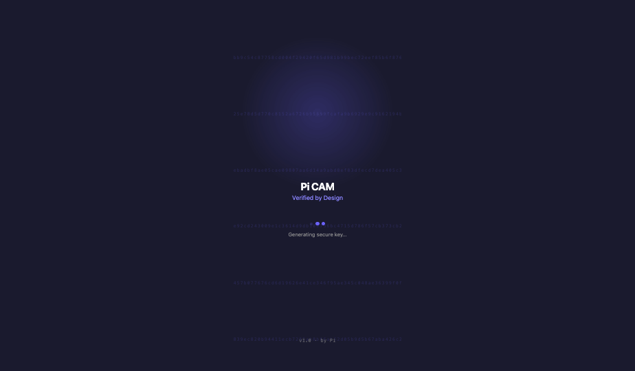

- **Purpose:** First frame on launch; covers initialization, key generation, or permission-error state.
- **Layout:** Full-bleed navy `#1A1A2E`, centered Pi shield logo with a pulse animation, status text below.
- **Variants by `status` prop:** `initializing` (default), `generating-key`, `error`.
- **Copy:** "Initializing…" / "Generating secure key…" / "Permission needed"

### S-09 — Onboarding (`screens/onboarding.jsx`)


- **Purpose:** First-run intro + key generation.
- **Layout:** 3 horizontal slides + 1 key-generation step, paged. Pagination dots, "Skip" top-right, "Next" / "Generate key" bottom CTA.
- **Slides:**
  1. **"Every shot, verified."** — Pi CAM signs every photo and video with a cryptographic proof. No one can fake what you captured.
  2. **"Works offline, always."** — (capture works without connectivity; CA cert is added later)
  3. (3rd slide — see file)
- **Key-gen step:** progress UI + final confirmation, then fires `onDone`.

### S-03 / S-04 — Camera (`screens/camera.jsx`)
The hero screen. **Three HUD variants × three capture FX variants**, all production-approved.

 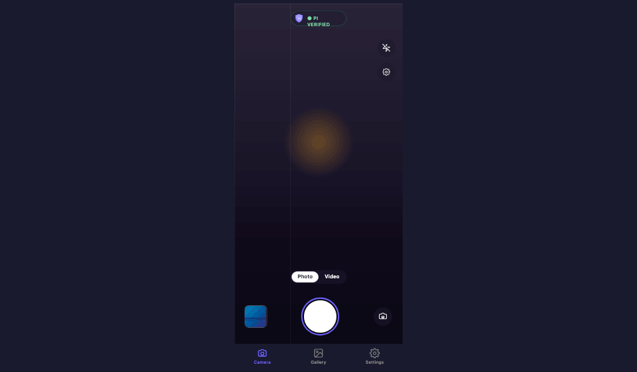 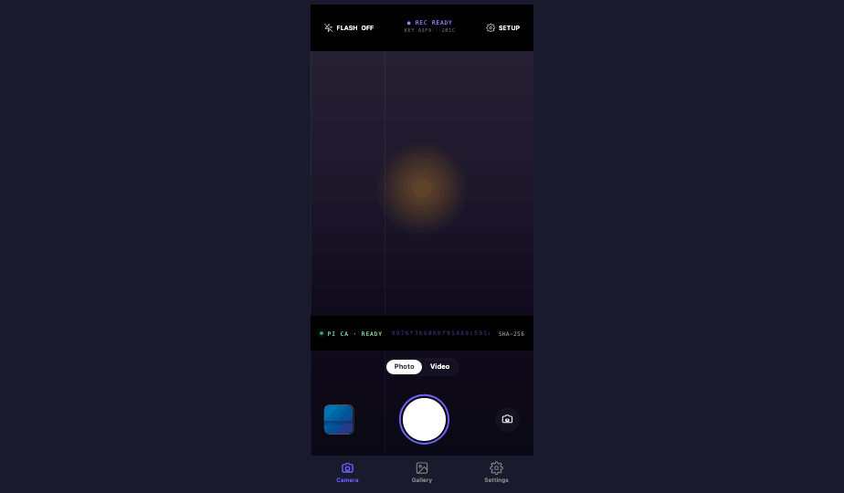

_Left → right: Classic · Minimal · Cinematic HUD._

- **Layout:** Full-bleed viewfinder (always `#111`). Top bar (flash, verification badge, settings), zoom pill, mode pill (Photo / Video) ~196px from bottom, bottom row (thumbnail · shutter · flip) ~72px from bottom over a 96px-tall area.
- **HUD variants:**
  - `classic` — top bar with flash, centered `VerificationBadge`, settings; zoom pill at top-center.
  - `minimal` — single floating Pi-mark pill at top; flash + settings stack on right rail.
  - `cinematic` — letterbox bars top + bottom; technical readouts (KEY `A3F9···2B1C`, `PI CA · READY`, scrolling hash stream, `SHA-256` label).
- **Capture FX variants** (fire on shutter tap, photo mode):
  - `hash` — white flash + ~28 hex glyphs rising from the lower viewfinder in purple `#6C63FF` with glow.
  - `ring` — white flash + 3 concentric purple ring shockwaves expanding from the shutter.
  - `stamp` — white flash + downward scan line + large Pi mark stamping the center.
- **Signing toast** (`SigningToast`) sequence on every photo: `signing` → `signed` (700ms) → `certifying` (1700ms) → `verified` (3000ms) → dismiss (4500ms).
- **Tap-to-focus:** orange `#F5A623` square ring at tap location, 60×60, 1.5s ease-out fade.
- **Video mode:** shutter changes to red record button; while recording, `● 00:24` chip pinned above shutter in `#E74C3C`.
- **Online vs Offline:** badge shows `Pi Verified` (green) or `Device Only` (orange).

### S-05 — Preview (`screens/preview.jsx`)

 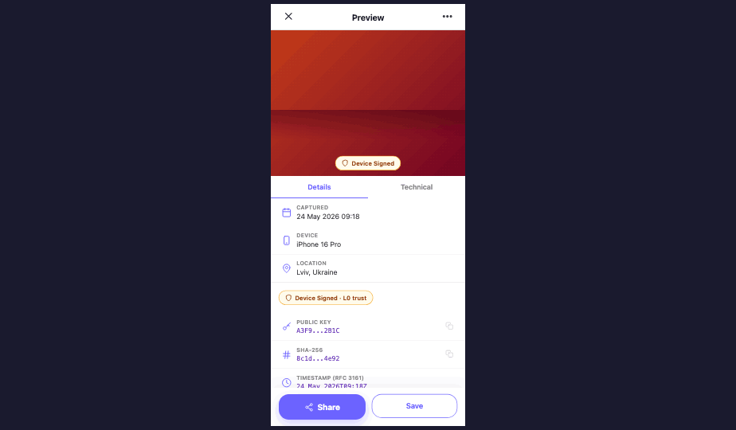

_Left: Pi Verified (CA). Right: Device Signed (offline capture)._

- **Purpose:** Single-photo viewer with verification provenance.
- **Layout:** 52px nav bar (close left, share right), photo, info card, tabbed lower section.
- **Tabs:** `details` (timestamp, location, device, hash, signer), `manifest` (formatted), `history` (assertions timeline).
- **Tap-to-copy** on hash and key fields with a 1.6s "Copied" toast.

### S-06 — Gallery (`screens/gallery.jsx`)


- **Purpose:** Browse all captures.
- **Layout:** 56px header (title, select / count), filter chips (`All` / `Pi Verified` / `Device Only`), 3-column grid of thumbnails with a small badge corner-pinned per item.
- **Selection mode:** activated by first tap-and-hold; header switches to count + bulk actions.
- **Empty state:** "Take your first verified photo" CTA → opens Camera.

### S-07 — Verify (`screens/verify.jsx`)


- **Purpose:** Verify a file from outside the app.
- **States:** `idle` (drop zone, "Try sample" button) → `verifying` (progress bar, 0→100 in ~1.4s) → one of `ca` / `device` / `tampered` / `none` (result card with badge, hash, signer, CTA).

### S-08 — Settings (`screens/settings.jsx`)


- **Purpose:** Configuration.
- **Layout:** iOS-style grouped sections on `bgAlt`. Sections: Account, Capture, Verification, Privacy, About.
- **Rows:** label + optional icon + value/toggle/chevron. Standard toggles for `location`, `watermark`, `autoCa`, `savePhotos`. Theme switch (light/dark). Online toggle (drives camera badge).
- **Destructive:** "Reset device key" opens a confirm sheet.

### S-10 — Manifest (`screens/manifest.jsx`)


- **Purpose:** Inspect a photo's C2PA manifest.
- **Layout:** Full-screen overlay with close button. Collapsible JSON tree, mono font, syntax highlighting (keys in `mono` accent color, strings in body color, booleans/numbers tinted).
- **Sample data:** see top of file — `claim_generator`, `title`, `format`, `assertions[]`, `signature_info`, `ca_certificate`.

---

## Shared Components (`lib/components.jsx`)

| Component | Purpose |
|---|---|
| `VerificationBadge` | The 5-state pill: `ca`, `device`, `error`, `signing`, `certifying`. Sizes `sm` / `md`. |
| `ShutterButton` | Big bottom-center capture button. Photo = white ring + white inner; Video = white ring + red inner; recording = pulsing red square. |
| `SigningToast` | Bottom-anchored toast with phase animation. |
| `TabBar` | Bottom nav, 3 tabs: Camera / Gallery / Settings. Dark over camera, theme-aware elsewhere. |
| `PillToggle` | Photo/Video segmented pill above shutter. |
| `CamControl` | Round glass-blur button for camera overlay (flash, settings, flip). |
| `FauxPhoto` | Placeholder photo renderer for prototype. **Replace with real `<Image>` in product.** |
| `PiMark` | The brand mark (shield with π glyph). |
| `HashStream` | Scrolling hex hash ticker used in Cinematic HUD. |
| `IconShield` / `IconShieldCheck` / `IconShieldX` / `IconZap` / `IconZapOff` / `IconSettings` / `IconFlip` / `IconSparkle` / `IconUser` / `IconClose` / `Chevron` / etc. | SVG icons (see `lib/icons.jsx`). Translate to the platform's icon system or keep as vector. |

---

## Interactions & Behavior

### Capture flow (Camera → Preview)
1. User taps shutter → white flash + chosen capture-FX overlay.
2. `SigningToast` cycles through `signing` (0ms), `signed` (700ms), `certifying` (1700ms), `verified` (3000ms), dismiss (4500ms).
3. New thumbnail slides into the thumbnail well after ~1000ms.
4. Tapping the thumbnail opens `PreviewScreen` (overlay, fade-in 200ms).

### Verification badge logic
- Online + signed by CA → `ca` (green "Pi Verified")
- Offline at capture → `device` (orange "Device Only")
- Manifest tampered → `error` (red "Verification failed")

### Navigation model
- **Tabs:** Camera / Gallery / Settings — bottom tab bar.
- **Overlays** (cover everything including tab bar): Preview, Verify, Manifest, Splash, Onboarding.
- A real app should map these to the platform's stack navigator + modal presentation.

### Animations (CSS keyframes in prototype)
| Name | Use | Duration |
|---|---|---|
| `pic-flash` | Capture flash | 220ms ease-out |
| `pic-focus` | Tap focus ring | 1.5s ease-out |
| `pic-glyph-rise` | Hash FX glyphs | 1.2s ease-out (staggered up to 250ms) |
| `pic-shockwave` | Ring FX | 1.1s ease-out (3 stagger 0/200/400ms) |
| `pic-stamp` | Stamp FX Pi mark | 800ms 300ms ease-out backwards |
| `pic-scan` | Stamp FX scan line | 800ms 100ms ease-in |
| `pic-fade-in` | Overlay enter | 200ms |

Translate to the platform's animation lib (Reanimated, SwiftUI animations, Compose animations).

### State management
Local React state only. State that should likely become app/global state in production:
- `theme` (light/dark) — user preference
- `online` (drives badge) — derived from network reachability
- `previewPhoto` — selected photo / route param
- Selection set in Gallery — local to that screen, fine
- Capture toggles in Settings — persistent user prefs

---

## Assets

All visuals in the prototype are **CSS-drawn or inline SVG**. No bitmaps. Real product will need:
- App icon (use Pi mark from `lib/components.jsx`)
- Onboarding illustrations (currently inline SVG `SlideIlloShield` etc. — fine to keep or replace with real illustrations)
- Real camera frames / real photo data — `FauxPhoto` is purely a placeholder

---

## Implementation Checklist

A reasonable order for Claude Code to build this:

1. **Tokens & theme** — port `lib/tokens.jsx` into the codebase's tokens module; wire light/dark.
2. **Icons** — port `lib/icons.jsx` (or map to existing icon set).
3. **Primitive components** — `VerificationBadge`, `ShutterButton`, `TabBar`, `PillToggle`, `CamControl`, `SigningToast`, `PiMark`.
4. **Splash + Onboarding** — easiest screens; verify theme + components in isolation.
5. **Camera** — start with the `classic` HUD + `hash` capture FX as the default; stub the other variants.
6. **Preview + Manifest** — wire to a real photo + a real manifest object.
7. **Gallery** — list + filters + selection.
8. **Verify** — drop zone / file picker.
9. **Settings** — toggles + theme + key reset confirm sheet.
10. **Wire the navigation** per `lib/app.jsx`'s tab + overlay model.

Cross-reference the original HTML side-by-side while building. Open `Pi CAM Design.html` in a browser to interact with the prototype.
